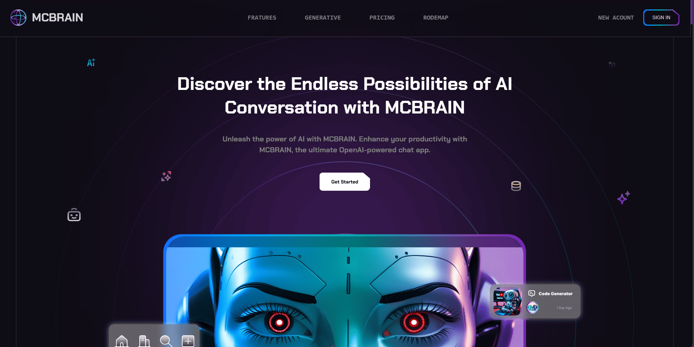

# 🤖 AI Landing Page  

A modern, responsive **AI Landing Page** built with **HTML, CSS, and JavaScript**. This project showcases a sleek, high-quality UI featuring gradient borders, hover effects, parallax scrolling, and scroll-triggered animations to deliver an engaging and dynamic user experience.

## 🎨 Features  

✅ **High-Quality UI** – Clean layout with modern fonts and color schemes  
✅ **Smooth Animations** – Enhances user experience with seamless transitions  
✅ **Scroll Animations** – Animate elements on scroll for dynamic interactions  
✅ **Responsive Design** – Looks great on all devices (desktop, tablet, mobile)  
✅ **Parallax Effects** – Adds depth and movement to background sections  
✅ **Optimized Performance** – Fast loading and smooth user interactions  
✅ **Clean Code Structure** – Well-organized, easy to customize and maintain  

## 🖥️ Technologies Used  

- **HTML5** – Semantic markup for better structure  
- **CSS3** – Custom properties, Flexbox, Grid, and animations  
- **JavaScript (ES6+)** – For interactivity, animations, and parallax effects  

## 📸 Preview  

## 🚀 Live Demo  

[🔗 Live Demo Here](https://ahmedragab15.github.io/AI-Landing-Page)  

